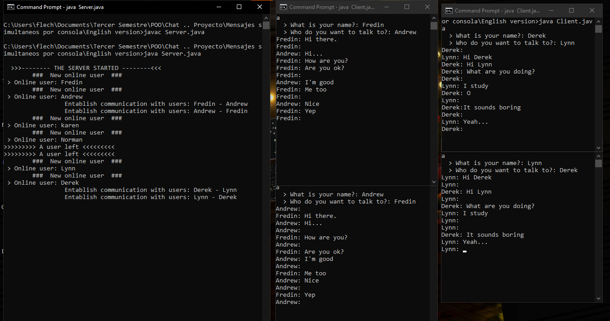

<h1 align="center">Chat app with Java sockets</h1>

<h3 align="center">Example of how the application works</h3>

  
  
   
  
  <h3 align="center">Explanation</h3>
  This program entablish the communication with two or more users, the simultaneous messages are possible so we can send 'n' messages in real time.
  
  The program was developed using sockets, that's why we need a server socket with a specific port number, the server is always alive so it accept socket users all time.   In this case, I creating a Server socket instance using a big port number (it's to prevent error with another port is already used) and Ip (local)  

